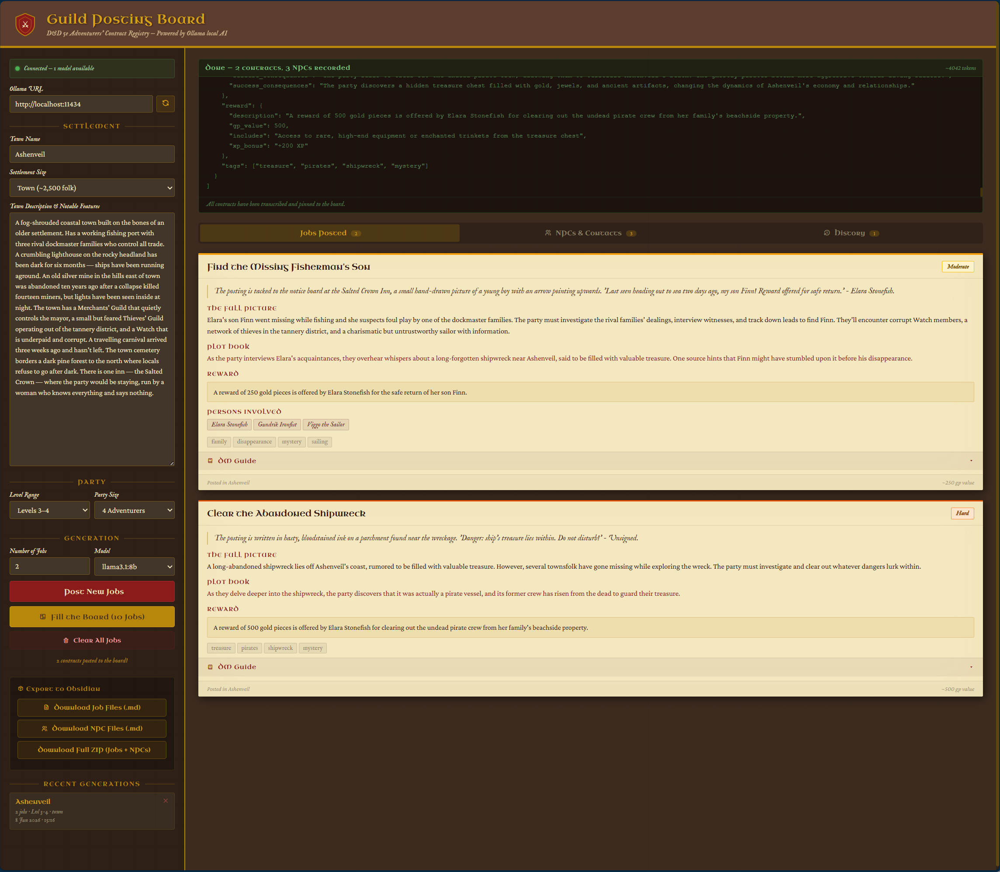
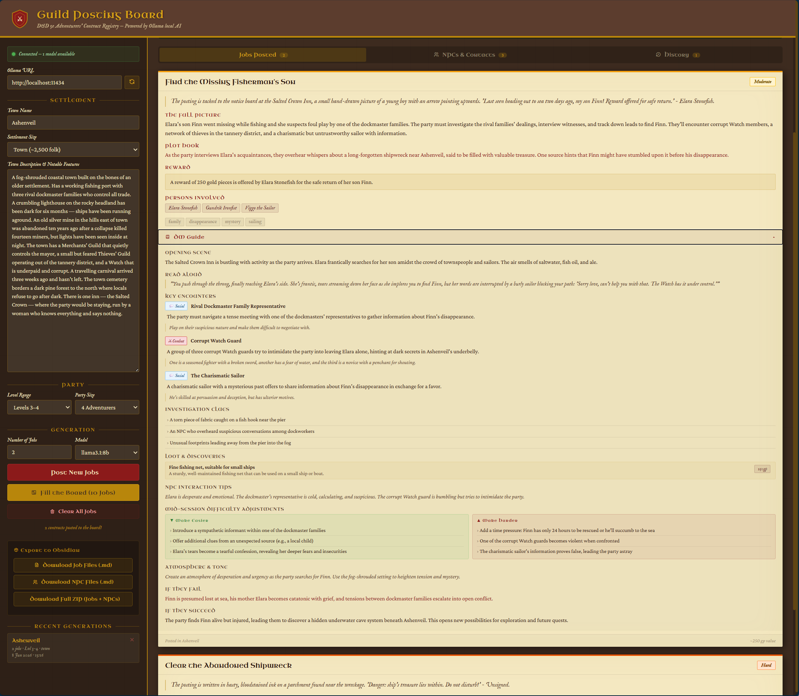
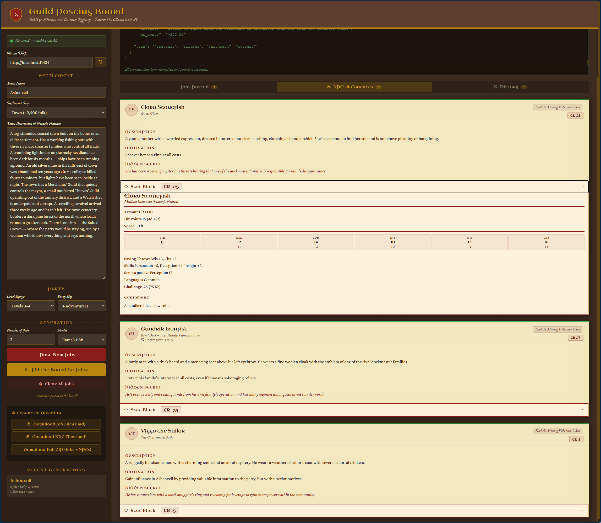
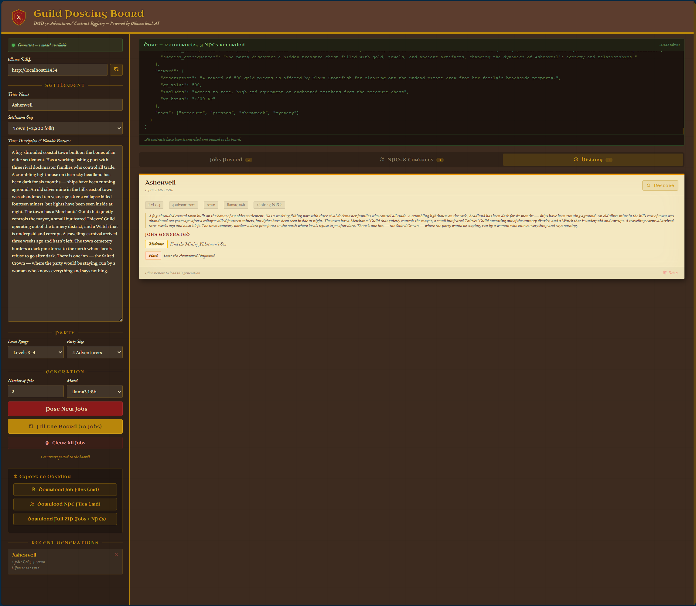

# QuestForge
An AI-powered D&D 5e quest board generator — runs entirely on your machine.
QuestForge is a single HTML file that turns your local Ollama AI into a Dungeon Master's prep assistant. Describe your town, set the party's level, and generate a full adventurers' guild notice board in seconds — no internet, no API keys, no subscription.
What it generates:

- Job postings written as in-world handwritten notices
- Full DM briefs with plot hooks, investigation clues, and read-aloud text
- Mid-session difficulty controls — make it harder or easier on the fly
- Complete NPC stat blocks (D&D 5e format) with actions, traits, equipment, and roleplaying notes
- Faction-aware NPCs — if the job involves the Thieves' Guild, you get a named guild member
- Loot tables and enemy/antagonist concepts scaled to party level
- Failure and success consequences that ripple into future sessions

## Prerequisites
- [Ollama](https://ollama.ai) installed and running
- At least one model pulled — recommended: `ollama pull llama3.1` or `ollama pull mistral`
- Any modern browser (Chrome, Firefox, Edge)
- No internet connection required after setup

## Recommended Models
| Model | Quality | Speed | Notes |
|-------|---------|-------|-------|
| `llama3.1` | ⭐⭐⭐⭐⭐ | Medium | Best overall output |
| `mistral` | ⭐⭐⭐⭐ | Fast | Good JSON compliance |
| `llama3.2` | ⭐⭐⭐⭐ | Fast | Solid, widely available |
| `phi3` | ⭐⭐⭐ | Very fast | Shorter outputs |

## Export to Obsidian:
One markdown file per quest, one per NPC, with YAML frontmatter and [[wikilinks]] already connected. Drop the ZIP straight into your vault.
Fully local. All generation runs through Ollama on your own machine. Your campaign stays yours.

## Images

*A full board generated for Ashenveil*

*Each quest includes a full DM session guide with read-aloud text and difficulty controls*

*Every NPC gets a complete D&D 5e stat block*

*A full history of what is generated*
